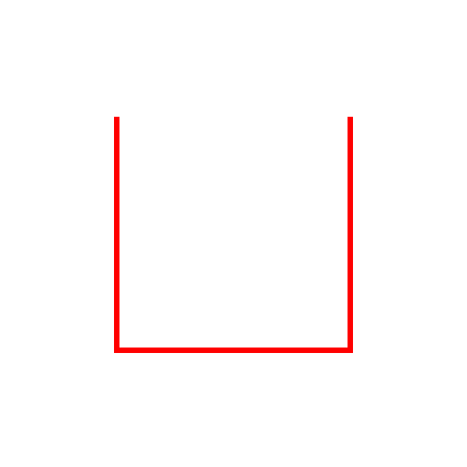

## Hilbert Curve

[The Hilbert Curve](https://en.wikipedia.org/wiki/Hilbert_curve) is a fractal, space-filling curve.

### Construction

The first order, or first iteration of the curve, starts with this U shape


The next order is the previous iteration rotated counterclockwise 90 degrees


Then the curve extends down and connects to another instance of the previous iteration


Then the curve extends right and connects to another instance of the previous iteration


Finally, the curve extends upward and connects to the last instance of the previous iteration, rotated 90 degrees clockwise


The easiest way to draw this by hand, in my opinion, is to draw the four copies of the previous iteration, then connect them like so:


With this simple ruleset, the Hilbert curve can recurse into itself with increasing complexity. Here is a simple function in Javascript to create Hilbert curves:

```javascript
// Returns a list of strokes to draw a Hilbert curve of order n
// The strokes are denoted:
//  'd' down
//  'r' right
//  'u' up
//  'l' left

// One optimization for Javascript could be to use numbers instead
// of single letter strings. Using letters for now for readability
hilbert = function(n)
{
    // The base case is first order Hilbert curve
    // Which is constructed with:
    // Down stroke, right stroke, up stroke
    if(n == 0)
    {
        return ['d', 'r', 'u']
    }

    var ret = [];

    // Only need to calculate this once
    // A memiozed function would be even better
    // But since n will probably be < 8, it's fine for now
    const prevHilbert = hilbert(n-1);

    // The counter-clockwise first curve
    ret.push(...rotateCCW(prevHilbert));
    
    // The connector between 1 and 2
    ret.push('d');
    
    // The curve again, this time 'upright'
    ret.push(...prevHilbert);

    // Connector between 2 and 3
    ret.push('r');

    // Another 'upright'
    ret.push(...prevHilbert);

    // Connector between 3 and 4
    ret.push('u');

    // Finally, the clockwise final curve
    ret.push(...rotateCW(prevHilbert));

    return ret;
}
```

We're also going to need the clockwise and counter-clockwise functions. Notice that in when rotated counter-clockwise, the strokes are also mirrored. They start on the right side of the shade instead of the left. Same goes for clockwise. Therefore, the strokes required to generate the first order Hilbert curve are now `['r', 'd', 'l']`

We can write some funtions that generalize this shift in perspective:

```javascript
rotateCCW = function(l)
{
    var ret = [];

    // The transforms are as follows:
    //  d -> r
    //  r -> d
    //  u -> l
    //  l -> u
    l.forEach(element => {
        switch(element)
        {
            case 'd':
                ret.push('r');
                break;
            case 'r':
                ret.push('d');
                break;
            case 'u':
                ret.push('l');
                break;
            case 'l':
                ret.push('u');
                break;
        }
    });

    return ret;
}

rotateCW = function(l)
{
    var ret = [];
   
    // The transforms are as follows:
    //  d -> l
    //  r -> u
    //  u -> r
    //  l -> d
    l.forEach(element => {
        switch(element)
        {
            case 'd':
                ret.push('l');
                break;
            case 'r':
                ret.push('u');
                break;
            case 'u':
                ret.push('r');
                break;
            case 'l':
                ret.push('d');
                break;
        }
    });

    return ret;
}
```

This gives us a nice, general way of describing Hilbert curves as a series of strokes. 

### Visualization

One possible implementation of these series of strokes visually is to write our strokes as an SVG image. Here is some code that converts our list of stokes to the `d` attribute of an SVG path:

```javascript
// Creates an SVG d attribute for generating
// an SVG image of a hilbert curve
//  n: The order of the curve
//  imageSize: The size of the final SVG
hilbertToSVGd = function(n, imageSize=512)
{
    // Notice that the width of the entire curve in strokes is
    // equal to (2x + 1), where x is the number of strokes wide
    // that the previous order curve was.
    // From this sequence, we get this pattern of widths as the order increases
    //  1,3,7,15,31,63,127 ...
    // Which is 2^x - 1. Therefore to fit an eponentially increasing
    // curve to the canvas, the size of each stroke needs to decrease
    // exponentially
    var strokelen = imageSize / Math.pow(2, n + 1);

    // Since the width of the whole curve is 2^x - 1, there is 1 stoke
    // worth of extra space on the canvas. By starting the curve a half
    // stroke down and to the right, the whole curve gets a margin of
    // one half stroke all around
    var dString = 'M' + strokelen / 2 + ',' + strokelen / 2;

    // The actual curve is generated
    const hilbertInstructions = hilbert(n);

    // Convert curve strokes to SVG strokes based on stroke size
    hilbertInstructions.forEach(instruction => {
        switch(instruction)
        {
            case 'd':
                dString += 'v' + strokelen;
                break;
            case 'r':
                dString += 'h' + strokelen;
                break;
            case 'u':
                dString += 'v-' + strokelen;
                break;
            case 'l':
                dString += 'h-' + strokelen;
                break;
        }
    });

    return dString;
}
```

Now, we can plug the results of this function into an SVG file like:

```svg
<?xml version="1.0" encoding="UTF-8"?>
<svg version="1.0" width="512" height="512" xmlns="http://www.w3.org/2000/svg">
 <path style="stroke:#f00;stroke-width:2;fill:none" d="{fill in from function}"/>
</svg>

```
To create some higher-order Hilbert curves. A seventh order curve for example:


### Advanced Visualization

The SVG files generated thus far are good for understanding the structure of the Hilbert curve, but it's possible to do more with the list of strokes than draw straight lines. We can model the construction of a Hilbert curve as being composed of three shapes: a straight piece, a counter-clockwise bend, and a clockwise bend.


In the above image, the counter-clockwise bend is highlighted in red, the clockwise bend is highlighted in green, and the straight piece is highlighted in blue. It might seem like the bend are just rotations of one another. That is true IF we do not care about directionality. But the strokes being generated DO care about directionality. 

Therefore, the counter-clockwise bend is used in the following transitions:

- Right to Up
- Up to Left
- Left to Down
- Down to Right

And the counter-clockwise bend is used in the following transitions:

- Up to Right
- Right to Down
- Down to Left
- Left to Up